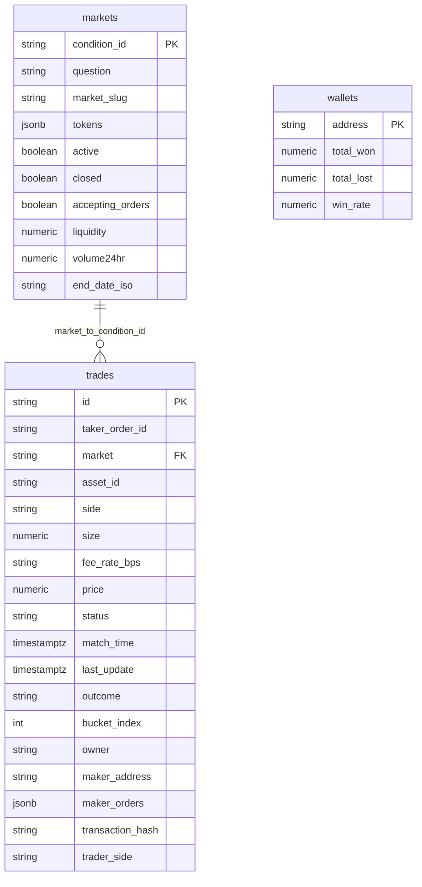

# План сущностей PostgreSQL под Polymarket

## Принцип именования

- **Имена колонок в PostgreSQL и свойств в TypeORM-сущностях** совпадают с именами полей в **сыром JSON CLOB** и с **`@polymarket/clob-client`** (`types.d.ts`), в том же **snake_case**, как в API (включая имена вроде `volume24hr` — как у upstream).
- Типы в БД могут отличаться от типов SDK (строка → `numeric` / `timestamptz`), но **имя поля не переводится** в другое английское слово (`market_slug`, а не `slug`; `volume24hr`, а не `volume_24h`).
- Внешние контракты приложения (`MarketDto` с `endDate`, `volume24h` и т.д.) остаются как есть; **маппинг DTO ↔ entity** делается явно в сервисах — так клиентский JSON не обязан копировать Polymarket дословно.
- Поля, которых **нет** в Polymarket (синхронизация, внутренний учёт), если нужны — только с префиксом **`internal_`** (`internal_synced_at`), чтобы не смешивать с контрактом API.

---

## Сверка черновика с полями Polymarket

| Черновик                     | Поле в API / SDK                                                                    | В БД                                                                                                                                                                                                                                             |
| ---------------------------- | ----------------------------------------------------------------------------------- | ------------------------------------------------------------------------------------------------------------------------------------------------------------------------------------------------------------------------------------------------ |
| Market.id                    | `condition_id`                                                                      | `condition_id` PK                                                                                                                                                                                                                                |
| Market.title                 | `question`                                                                          | `question`                                                                                                                                                                                                                                       |
| (slug)                       | `market_slug`                                                                       | `market_slug`                                                                                                                                                                                                                                    |
| Market.odds                  | одного поля нет; котировки по исходам — через `tokens` / стакан                     | хранить сырой массив как в маркете: колонка `**tokens` (JSONB), без выдуманного `odds`                                                                                                                                                           |
| Market.volume                | `volume24hr` в `[PolymarketMarketRaw](src/polymarket/dto/polymarket-market.raw.ts)` | `**volume24hr`                                                                                                                                                                                                                                   |
| Market.deadline              | `end_date_iso`                                                                      | `**end_date_iso`** (как в API: `text` с ISO или `timestamptz` — на выбор реализации, имя колонки `**end_date_iso\*\`)                                                                                                                            |
| Trade.market_id              | в типе `Trade` поле называется `**market` (condition id)                            | `**market` + FK на `markets.condition_id`                                                                                                                                                                                                        |
| Trade.wallet                 | в `Trade`: `**owner`**, `**maker_address\*\`; в WS `last_trade_price` адреса нет    | хранить `**owner`**, `**maker_address\*\`как в REST; не вводить одно поле`wallet` в схеме БД под Polymarket                                                                                                                                      |
| Trade.amount                 | `**size`                                                                            | `**size`                                                                                                                                                                                                                                         |
| Trade.side, price, timestamp | `side`, `price`, `**match_time`**, `**last_update\*\`                               | те же имена; время — из строк API в `timestamptz` при сохранении                                                                                                                                                                                 |
| Wallet.                      | в CLOB/SDK **нет** объекта «кошелёк с PnL»                                          | таблица агрегатов **вне контракта** Polymarket: оставить осмысленные доменные имена (`address`, `total_won`, `total_lost`, `win_rate`) или зафиксировать префикс `internal` для всех колонок этой таблицы — зафиксировать в код-ревью одну схему |

---

## 1. Таблица `markets` (как `GET /markets` / `PolymarketMarketRaw`)

Колонки (имена = API):

- `condition_id` — PK, `varchar`
- `question`
- `market_slug`
- `tokens` — JSONB (как приходит/нормализуется из upstream)
- `active`, `closed`, `accepting_orders` (optional boolean)
- `liquidity`, `volume24hr` — числовой тип по смыслу (`double precision` / `numeric`)
- `end_date_iso` — как в API (`text` или преобразование в `timestamptz` с **тем же именем колонки**)

Служебное (не из Polymarket): например `internal_synced_at`, при необходимости `internal_created_at` / `internal_updated_at`.

**Индексы:** `market_slug` (unique, если upstream гарантирует уникальность), `(active, closed)`, при необходимости по `end_date_iso` / `volume24hr` под реальные запросы.

---

## 2. Таблица `trades` (как `Trade` в `@polymarket/clob-client`)

Поля из SDK **один в один** (тип `Trade` в `types.d.ts`):

- `id` — PK, `varchar` (идентификатор сделки CLOB; для событий без `id` из другого канала — отдельная политика ниже)
- `taker_order_id`
- `market` — FK → `markets.condition_id`
- `asset_id`
- `side`
- `size`, `fee_rate_bps`, `price`, `status`
- `match_time`, `last_update` — хранение как `timestamptz` после парсинга строк API
- `outcome`, `bucket_index`
- `owner`, `maker_address`
- `maker_orders` — JSONB (массив объектов как в API)
- `transaction_hash`
- `trader_side`

**WS `last_trade_price`:** покрывает только часть полей; при записи в ту же таблицу остальные колонки NULL, `**id`** — либо не писать строку без уникального `id`, либо завести `**internal_row_id`**UUID PK и сделать`id` nullable с уникальным ограничением только когда заполнен — это единственное осознанное отступление от «все строки имеют CLOB id», его зафиксировать в реализации.

**Индексы:** UNIQUE(`id`) где строка из REST; `(market, match_time DESC)`; `(owner, match_time DESC)`; `(maker_address, match_time DESC)`; `(asset_id, match_time DESC)` — по профилю запросов.

---

## 3. Таблица `wallets` (агрегаты приложения)

Polymarket не отдаёт эту сущность: имена `**address`_, `total_won`, `total_lost`, `win_rate` — доменные, без подмены под несуществующие поля API. При желании единообразия с «внутренними» полями можно переименовать в `internal_address` и т.д. — в плане зафиксировано: либо доменные короткие имена, либо префикс `internal\_`_ для всей таблицы (выбрать один стиль в реализации).

---

## NestJS / TypeORM

- Файлы `*.entity.ts` в модулях по [docs/PROJECT_STRUCTURE.md](docs/PROJECT_STRUCTURE.md).
- `[buildTypeOrmConfig](src/config/typeorm.config.ts)`: `autoLoadEntities: true`, `synchronize: false`, миграции из `src/migrations`.



---

## Команды миграций

После добавления entity и при доступной БД (`DATABASE_URL`):

```bash
npm run typeorm -- migration:generate src/migrations/MarketsTradesWallets -d src/data-source.ts
```

Пустой файл:

```bash
npm run migration:create -- src/migrations/ManualMigrationName
```

Применить / откатить:

```bash
npm run migration:run
npm run migration:revert
```

---

## Документация для агентов

**Отдельного `AGENTS.md` в репозитории нет.** То, на что уже опираются правила Cursor и агенты:

- [docs/PROJECT_STRUCTURE.md](docs/PROJECT_STRUCTURE.md) — модули домена (в т.ч. `markets`, `trades`, `wallets`); сюда после внедрения сущностей стоит добавить подраздел **«Персистенс / TypeORM»**: таблицы, связь с Polymarket-именами колонок, путь миграций `src/migrations/`, команды `npm run migration:*`, принцип `internal_*`.
- [docs/CURSOR_SETUP.md](docs/CURSOR_SETUP.md) — рекомендации агенту; при желании одна строка-отсылка «схема БД и соглашения — в PROJECT_STRUCTURE».
- [.cursorrules](.cursorrules) и [.cursor/rules/project.mdc](.cursor/rules/project.mdc) — оперативные правила; при существенном изменении потока данных можно добавить пункт «имена колонок = CLOB/SDK».

Задача **`docs-agents`** в трекере плана: после реализации entity и миграций **обновить `docs/PROJECT_STRUCTURE.md`** (минимально достаточно для следующего агента); остальное — по необходимости.

---

## Отложено (YAGNI)

- Отдельные таблицы ордеров / позиций.
- Полная 1:1 запись `MarketTradeEvent` из SDK — по необходимости позже.
